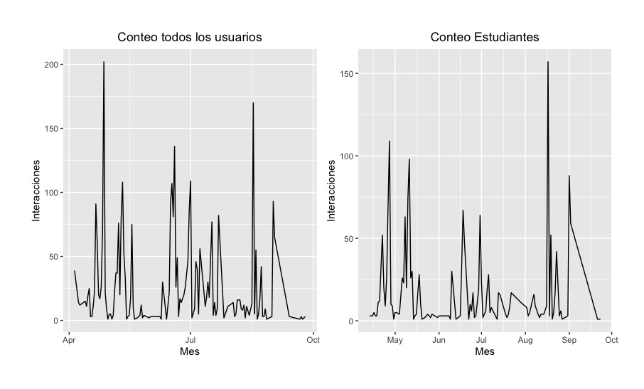

# Learning Analytics con R studio 
Este es la documentación del proceso de limpieza y visualización de un conjunto de datos extraídos de Moodle. El conjunto de datos fue obtenido en un lapso de 7 meses de las cuales existen fechas en que no se registraron ingresos al curso. Este conjunto de datos no presenta valores N/A. Los datos presentan datos de fecha, varialbles cualitativas (categorías) y númericas de Direción IP.

## Procedimiento
* [Preparación de los datos] (#preparacion-de-los-datos)
* [Limpieza de los datos] (#limpieza-de-los-datos)
* [Transformación de los datos] (#transformacion-de-los-datos)
* [Visualización de los datos] (#visualizacion-de-los-datos)

## Preparación de los datos 
El archivo "log_p.csv" fue pre-procesado en Microsoft Excel y fue exportado en .csv con codificación UTF-8. Se realizaron las siguientes acciones
* Combinación de las variables de "Nombre.de.usuario.completo" y "Usuario.afectado"
* La variable "Contexto.del.evento" fue modificado para reducir la extensión de los nombres de cada categoría y se encuentra en el archivo readme/Contexto_del_evento.txt 
* Conversión de la variable "Hora" a formato fecha
* Anonimizado de los participantes

## Limpieza de los datos
Los datos fueron importados desde el archivo [log_p.csv](https://github.com/sergiogonzalezdgp/tesis/log_p.csv) , tomando la primera fila como nombres de columna, usando una "," como separador y especificando codificación UTF-8 y fue almacenado en el objeto `dscompleto`.

## Transformación de los datos
Se cargaron las siguientes librerías
```
library(tidyverse)
library(dplyr)
library(lubridate)
```
### Separación del conjunto de datos
Posteriormente se creó un objeto que excluye las variables de "Dirección.IP", "Origen" y "Descripción" y fue almacenado en el objeto `log`. La columna hora fue transformado a formato fecha.
```
log <- dscompleto
log <- rename(log, Fecha = Hora)
log <- select(log, -Descripción, -Origen, -Dirección.IP)
log <-  filter(log, Contexto.del.evento != "189.148.203.31") 
log <- filter(log, Nombre.completo.del.usuario != "-")
log$Fecha <- as.Date(log$Fecha, format="%Y-%m-%d")
```
También, se excluyeron aquellos registros realizados por el administrador, investigador y profesor de la asignatura para crear un segundo objeto llamado `estudiantes`. 
```
estudiantes <- filter(log, Nombre.completo.del.usuario != "Admin" & Nombre.completo.del.usuario != "Investigador" & Nombre.completo.del.usuario != "Profesor") 
estudiantes$Nombre.completo.del.usuario <- as.factor(estudiantes$Nombre.completo.del.usuario ) 
estudiantes$Contexto.del.evento <- as.factor(estudiantes$Contexto.del.evento) 
estudiantes$Componente <- as.factor(estudiantes$Componente)
estudiantes$Nombre.evento <- as.factor(estudiantes$Nombre.evento)
```
### Tablas de frecuencia
Se generaron dos objetos para el conteo total de registros `interacciones_cnt` y el conteo total de los estudiantes `usuarios_cnt`. Ambos fueron transformados a tablas de frecuencia a partir de las fechas en que se generaron los registros en plataforma.
```
#Recuento de interacciones totales
interacciones_cnt <- table(unlist(log$Fecha))
interacciones_cnt <- as.data.frame(interacciones_cnt)
interacciones_cnt <- rename(interacciones_cnt, fecha = Var1, cnt = Freq)
interacciones_cnt$fecha <- as.Date(interacciones_cnt$fecha, format="%Y-%m-%d")

#Recuento de usuarios
usuarios_cnt <- table(unlist(estudiantes$Fecha))
usuarios_cnt <- as.data.frame(usuarios_cnt)
usuarios_cnt$Var1 <- as.character(usuarios_cnt$Var1)
usuarios_cnt <- rename(usuarios_cnt, fecha = Var1, cnt = Freq)
usuarios_cnt$fecha <- as.Date(usuarios_cnt$fecha, format="%Y-%m-%d")
```
### Componentes y Contexto del evento
Para obtener una comparativa de las frecuencias de usuarios totales y estudiantes se combinaron las tablas de frecuencias para crear un nuevo objeto llamado "int_join". Se combinaron hacia la izquierda según la fecha de entrada de los usuarios totales y luego se reemplazaron los valores N/A por 0.
```
int_join <- interacciones_cnt %>% left_join(usuarios_cnt, by = "fecha")
int_join <- rename(int_join, Total = cnt.x)
int_join <- rename(int_join, Participantes = cnt.y)
int_join[is.na(int_join)] <- 0
```
### Tabla de contingencia
Para poder observar los componentes más utilizados de la plataforma se construye una tabla de contingencia con el recuento de estudiantes que accedieron a los diferentes componentes del sistema y contextos de los eventos.

```
UC <- table(estudiantes$Nombre.completo.del.usuario, estudiantes$Componente)
UCE <-  table(estudiantes$Nombre.completo.del.usuario, estudiantes$Contexto.del.evento)
```
## Visualización de los datos
### Carga de librerías
Se carga la librería ggpubr para visualizar diferentes gráficos en un mismo plot. Se utiliza además `ggplot2` que ya ha sido cargado anteriormente con las librerías anteriores.
```
library(ggpubr)
```
### Graficando el acceso al curso
El primer paso fue obtener una imagen global de los accesos al curso a través del tiempo. Para esto se generaron dos gráficas para comparar el comportamiento general de todos los usuarios (registros completos de plataforma) y los estudiantes. 
```
it_g <- ggplot(interacciones_cnt, aes(fecha, cnt)) + geom_line() + scale_x_date('Mes') +
        ylab("Interacciones") + xlab("") + labs(title="Conteo todos los usuarios") +
        theme(plot.title = element_text(hjust = 0.5))
ut_g <- ggplot(usuarios_cnt, aes(fecha, cnt)) + geom_line() + scale_x_date('Mes')  + 
        ylab("Interacciones") + xlab("") + labs(title="Conteo Estudiantes") +
        theme(plot.title = element_text(hjust = 0.5))
figura1 <- ggarrange(it_g, ut_g, ncol = 2, nrow = 1) + theme(plot.margin = unit(c(1, 1, 1, 1), "cm"))
```


```